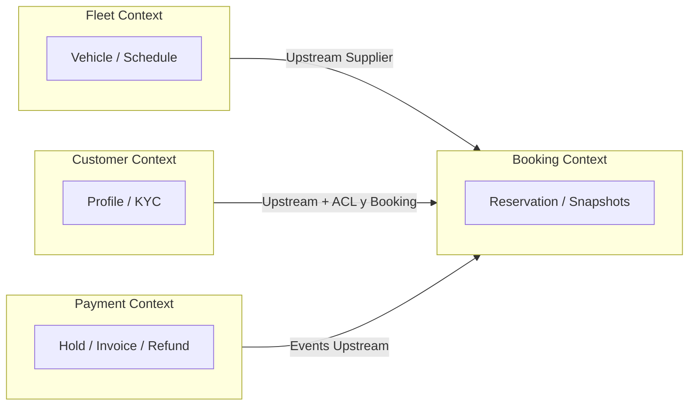

# ARCHITECTURE_PROPOSAL

Груповий проєкт: сервіс оренди автомобілів (Car Rental Service).

Команда:
Лис Тарас Олександрович ІПЗ-4
Тарасенко Тимофій Миколайович ІПЗ-4

---

## Крок 1. Вибір бізнес-домену

**Домен:** сервіс оренди автомобілів (Car Rental Service).

Система покриває повний цикл оренди ТЗ: пошук і бронювання → перевірка клієнта → холдування коштів → видача авто → повернення → фінальний розрахунок / скасування зі звільненням ресурсу та поверненням коштів.

---

## Крок 2. Ключові бізнес-сценарії (E2E)

### Сценарій 1. Оформлення бронювання та холдування коштів

1. Клієнт обирає дати й доступне авто (`Fleet` перевіряє вільний слот).
2. Система перевіряє право клієнта на оренду (`Customer`: верифікація профілю / водійського посвідчення).
3. `Booking` створює резервацію зі знімками даних авто та тарифу (`VehicleSnapshot`, `TariffSnapshot`).
4. `Payment` холдує суму на картці; за успіхом `Booking` підтверджує резервацію, `Fleet` фіксує зайнятість у розкладі.

### Сценарій 2. Скасування бронювання клієнтом

1. Клієнт скасовує резервацію до початку періоду оренди.
2. `Booking` застосовує політику скасування (повне повернення / штраф).
3. `Payment` робить refund або partial capture штрафу.
4. `Fleet` звільняє слот у розкладі; авто знову доступне для нових бронювань.

### Сценарій 3. Завершення оренди та фінальний розрахунок

1. Клієнт повертає авто; адміністратор фіксує пробіг і пошкодження (`Fleet`: стан ТЗ / maintenance).
2. `Booking` формує підсумкову вартість (базова оренда + доплати / штрафи).
3. `Payment` списує фінальну суму з холду, генерує інвойс або вимагає доплату.
4. `Fleet` переводить авто у статус «потребує обслуговування / мийки» до наступної доступності.

---

## Крок 3. Bounded Contexts

Система декомпозована на **4 незалежні домени**:

| Контекст | Відповідальність |
| :--- | :--- |
| **Booking** | Життєвий цикл резервації, оркестрація сценаріїв оренди, статуси, розрахунок вартості за знімками тарифу |
| **Fleet** | Автопарк, технічний стан, локації, доступність і розклад зайнятості |
| **Payment** | Холд / capture / refund, інвойси, методи оплати, інтеграція з платіжним шлюзом |
| **Customer** | Профіль клієнта, KYC, водійське посвідчення, верифікація права на оренду |

---

## Крок 4. Ізоляція даних та Domain Snapshot

Кожен контекст має **власне сховище** і **не читає чужі таблиці напряму**. Обмін — лише через API / події та локальні знімки.

| Контекст | Власні сутності | Точки збереження зрізів (Domain Snapshot) |
| :--- | :--- | :--- |
| **Booking** | `Reservation`, `ReservationItem`, `CancellationPolicyRef`, `VehicleSnapshot`, `TariffSnapshot`, `CustomerRef` | При створенні резервації зберігаються знімки авто (марка, модель, номер, клас) і тарифу (денна ставка, депозит, штрафи). Подальші зміни у `Fleet` / прайсингу не змінюють уже оформлену угоду. |
| **Fleet** | `Vehicle`, `Location`, `ScheduleSlot`, `MaintenanceLog`, `VehicleCondition` | При блокуванні слоту зберігається зріз причини зайнятості (`reservationId` як зовнішній ref + період). При поверненні авто — зріз стану (пробіг, пошкодження) для подальшого maintenance. |
| **Payment** | `PaymentIntent`, `Transaction`, `Invoice`, `Refund`, `PaymentMethod` | При холді / capture зберігається фінансовий зріз: сума, валюта, `reservationId`, тип операції. Історія платежів незалежна від статусів у `Booking`. |
| **Customer** | `UserProfile`, `DriverLicense`, `VerificationStatus`, `Consent` | Інші домени отримують лише `customerId` і результат перевірки. Snapshot для Booking: мінімальний `CustomerRef` (id + verificationOutcome на момент бронювання). ПІБ / номери документів не витікають у суміжні БД. |

**Правило ізоляції:** зовнішні ідентифікатори (`reservationId`, `vehicleId`, `customerId`) — лише посилання; деталі сутностей інших контекстів копіюються у snapshot лише в момент бізнес-події, коли це потрібно для незмінності угоди.

---

## Крок 5. Матриця зв'язків (Context Map)

Ролі: **U** = Upstream, **D** = Downstream, **C/S** = Customer/Supplier, **ACL** = Anti-Corruption Layer, **OHS** = Open Host Service (публічний контракт API), **PL** = Published Language (події / DTO контракту).

| Від → До | Booking | Fleet | Payment | Customer |
| :--- | :--- | :--- | :--- | :--- |
| **Booking** | — | D → U, **Customer** до Fleet (**Supplier**); запит доступності | D → U; ініціює hold/capture/refund; слухає події Payment | D → U + **ACL**; запитує лише «чи можна орендувати» |
| **Fleet** | U (**Supplier** / OHS API доступності) | — | немає прямого зв’язку | немає прямого зв’язку |
| **Payment** | U (події `PaymentAuthorized` / `PaymentFailed` / `RefundCompleted`, PL) | немає прямого зв’язку | — | опційно U для токенізованого `paymentMethod` клієнта |
| **Customer** | U (верифікація); модель захищена **ACL** у Booking | немає прямого зв’язку | слабкий зв’язок через id / токен методу оплати | — |

### Деталі відносин

1. **Booking (Downstream) ↔ Fleet (Upstream)** — **Customer / Supplier**  
   Booking залежить від доступності авто. Fleet як Supplier надає стабільне API розкладу під потреби Booking.

2. **Booking (Downstream) ↔ Customer (Upstream)** — **ACL**  
   Booking не знає внутрішньої моделі KYC. ACL у Booking зводить відповідь Customer до простого правила валідації (`allowed` / `denied` + причина), ізолюючи Booking від паспортів і прав.

3. **Booking (Downstream) ↔ Payment (Upstream)** — **Upstream/Downstream + Published Language (події)**  
   Booking ініціює платіжні команди; Payment публікує результат асинхронно. Домени розв’язані: Booking змінює статус резервації лише за подіями, без спільної БД.

---

## Крок 6. Архітектурні рішення (коротко)

- Межі контекстів = межі даних; синхронні запити (REST/gRPC) лише там, де потрібна негайна відповідь (доступність, верифікація); асинхронні події — для платежів і побічних ефектів розкладу.
- Незмінність бізнес-угоди забезпечується **Domain Snapshot** у Booking (і фінансовими зрізами в Payment).
- Подальша реалізація можлива як модульний моноліт (окремі модулі + події) або як окремі сервіси з власними БД; обидва варіанти зберігають ті самі bounded contexts і Context Map.
